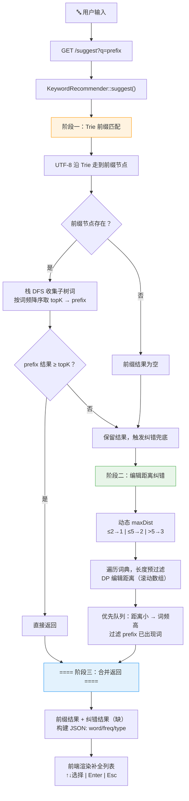
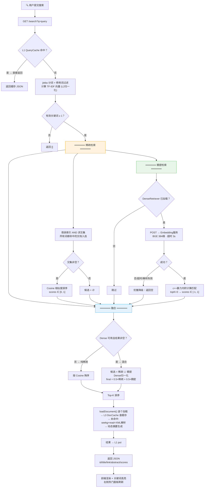

# 🔍 Search Engine — 全文搜索引擎
--wzh

一个基于 **C++17** 的全文搜索引擎，支持中英文混合检索，采用**稀疏检索（TF-IDF）+ 稠密检索（BERT Embedding）** 的混合召回架构，提供 Web 搜索界面和关键词自动补全/纠错功能。


## 目录

- [特性](#特性)
- [系统架构](#系统架构)
- [检索流程](#检索流程)
- [缓存设计](#缓存设计)
- [目录结构](#目录结构)
- [依赖](#依赖)
- [构建 & 运行](#构建--运行)
- [API 参考](#api-参考)
- [配置参数](#配置参数)
- [核心设计决策](#核心设计决策)

---

## 特性

- 🔡 **中英文双语支持** — 中文采用 jieba 分词，英文采用空格分词，停用词过滤
- 🔀 **混合检索** — TF-IDF 稀疏检索 + BGE 稠密向量检索，线性加权融合
- 💡 **关键词联想** — 基于 Trie 的前缀匹配 + 编辑距离纠错，实时补全
- 🗂️ **离线-在线分离** — 索引构建与搜索服务独立部署，互不干扰
- ⚡ **高性能 C++ 核心** — C++17 + wfrest 异步 HTTP 框架，低延迟响应
- 🎨 **简洁 Web UI** — 仿搜索引擎风格的 SPA 前端，支持高亮、键盘导航
- 🔄 **优雅降级** — Embedding 服务不可用时自动回退到纯 TF-IDF 检索
- 🧹 **近重复检测** — 基于 SimHash + 海明距离的文档去重
- 🚀 **双层缓存** — L1 查询结果缓存 + L3 文档内容缓存，大幅减少重复计算和磁盘 I/O
- 📊 **实时热门** — 基于用户点击行为的热门文档追踪，min-heap Top-K 排行，前端实时展示

---

## 系统架构

```mermaid
flowchart TB
    subgraph 离线模块["📦 离线索引流水线 (bin/offline)"]
        direction TB
        A1[corpus/CN/*.txt] --> KP1[KeywordProcessor<br/>中文词典]
        A2[corpus/EN/*.txt] --> KP2[KeywordProcessor<br/>英文词典]
        A3[corpus/webpages/*.xml] --> PP[PageProcessor]

        KP1 --> F1[(cn_dict.dat<br/>cn_index.dat)]
        KP2 --> F2[(en_dict.dat<br/>en_index.dat)]
        PP --> F3[(pages.dat + offsets.dat<br/>+ inverted_index.dat)]
    end

    subgraph 离线Embedding["🐍 离线 Embedding 生成"]
        F3 -->|读取 pages.dat| GEN[generate_doc_embeddings.py<br/>BGE-small-zh-v1.5]
        GEN --> F4[(doc_embeddings.dat)]
    end

    subgraph 在线模块["🌐 在线搜索服务 (bin/main)"]
        direction TB
        B1[wfrest HTTP Server :8080] --> B2[SearchService]
        B2 --> B3[KeywordRecommender<br/>Trie 前缀 + 编辑距离]
        B3 --> F1
        B3 --> F2
        B2 --> F3
        B2 --> F4
        B2 --> B4[QueryCache | DocCache<br/>双层查询缓存]
        B2 -->|HTTP POST :8765| EMB[query_embedding_server.py<br/>FastAPI]
    end

    UI[🖥️ static/index.html<br/>搜索 UI] -->|GET /search<br/>GET /suggest<br/>GET /hot| B1

    style 离线模块 fill:#fff3e0,stroke:#ff9800
    style 离线Embedding fill:#e8f5e9,stroke:#4caf50
    style 在线模块 fill:#e3f2fd,stroke:#2196f3
    style UI fill:#fce4ec,stroke:#e91e63
```

## 检索流程

### 关键字推荐流程



### 网页搜索流程



> **融合策略：** 稀疏检索 AND 语义保证精度，稠密检索捕获语义相关但字面不匹配的文档。候选集取并集，α=0.5 加权融合。Embedding 文件缺失/服务不可达/超时/解析失败均自动回退到纯 TF-IDF，不影响主流程。

---

## 缓存设计

搜索引擎采用**双层缓存架构**，从查询级别到文档级别逐层消除重复计算和 I/O。热门文档追踪独立于缓存体系，基于用户点击行为驱动。

```
用户搜索 "比特币"
  │
  ├─ L1 QueryCache (query → JSON)
  │     Key:   "比特币" (trim + lowercase 标准化)
  │     Value: JSON 字符串
  │     策略:  LRU + TTL (1000 条 / 5 min)
  │     命中:  跳过全部后续计算，直接返回 JSON
  │
  └─ L1 未命中 → 完整检索流程
       ├─ 分词 → TF-IDF → 倒排交集 → 余弦 → Dense → 融合排序
       ├─ 构建 JSON 时逐个 loadDocument(docId)
       │     │
       │     └─ L3 DocCache (docId → DocMeta)
       │           Key:   int docId
       │           Value: DocMeta { title, link, content }
       │           策略:  LRU (500 篇)
       │           命中:  零 I/O 返回文档内容
       │           未命中: seekg + read + XML 解析 → put 缓存
       │
       └─ 结果 JSON → L1 put

用户点击标题 → POST /click?id=xxx → HotTracker.recordClick()
       │
       └─ GET /hot?k=10 → 按点击次数排名 → 右侧热门面板渲染
            (unordered_map 计数 + min-heap Top-K)
```

### 各层对比

| 层 | 类 | Key | Value | 容量 | TTL | 数据结构 | 收益 |
|----|----|-----|-------|------|-----|----------|------|
| L1 | `QueryCache` | query string | JSON | 1000 | 5 min | LRU list + hashmap | 省全部计算 |
| L2 | *(规划中)* | query string | `vector<float>` | — | — | — | 省 HTTP 3s |
| L3 | `DocCache` | int docId | DocMeta | 500 | 无 | LRU list + hashmap | 省磁盘 I/O |

> **注意：** HotTracker 不属于缓存层。它是独立的用户行为追踪模块，仅对用户点击（`POST /click`）作出反应，与 L1/L2/L3 缓存无耦合。

### 线程安全

缓存层均使用 `std::shared_mutex` 读写锁：
- **读操作**（`get`）：`shared_lock`，允许多线程并发读
- **写操作**（`put`/`evict`）：`unique_lock`，独占写

HotTracker 同样使用 `shared_mutex` 保护 `recordClick()` / `topK()`。

搜索场景读远多于写，读写锁避免了不必要的互斥开销。

### 热门文档追踪算法

```
HotTracker:
  recordClick(docId):
    counts_[docId]++               ← O(1) 增量更新
  
  topK(k):
    if clickCount == 0: skip       ← 只关注被点击过的文档
    min-heap (小根堆) size=k         ← O(N log K)
    for each (docId, clickCount):
      if heap.size < k: push
      else if clickCount > heap.top: pop + push
    return reverse(heap)            ← 降序输出
```

选择 min-heap 而非全排序是因为 K=10 ≪ N（文档总数），O(N log K) ≈ O(N)，胜过 `std::sort` 的 O(N log N)。

---

## 日志系统

基于 **spdlog**（v1.14.1, header-only）的结构化日志，替换零散的 `cout`/`cerr` 输出。

### 输出目标

| 目标 | 级别 | 说明 |
|------|------|------|
| 控制台 | INFO+ | 彩色格式，开发时实时查看 |
| `logs/search.log` | TRACE+ | 每日 0 点轮转，保留最近 7 天 |

### 日志级别使用策略

```
TRACE  — 缓存逐出/命中、TTL 过期、embedding 维度
DEBUG  — 每次搜索的关键词/候选数/融合模式、缓存命中/未命中
INFO   — 服务启动、索引加载、离线阶段完成
WARN   — Embedding 文件缺失/服务超时、dense 不可用（优雅降级）
ERROR  — 文件打开失败、服务启动失败
```

### 使用示例

```cpp
#include "Logger.h"

LOG_INFO("Index loaded: {} documents", totalDocs);
LOG_DEBUG("L1 cache hit for query: \"{}\"", query);
LOG_WARN("Dense retriever not available, will use TF-IDF only");
LOG_ERROR("Failed to open offsets file: {}", path);
```

> 所有 `LOG_*` 宏自动携带时间戳、文件名和行号，格式为 `[2026-06-26 21:30:05.123] [info] [SearchServer.cc:22] message`。

---

## 目录结构

```
Search_Engine_cpp/
├── README.md                       # 本文件
├── Makefile                        # 构建系统
├── .gitignore
│
├── bin/                            # 编译产物 (gitignored)
│   ├── main                        # 在线搜索服务
│   └── offline                     # 离线索引工具
│
├── build/                          # 中间目标文件 (gitignored)
│
├── include/                        # 头文件 (11 个)
│   ├── DirectoryScanner.h          # 目录扫描器
│   ├── KeywordProcessor.h          # 关键词词典构建器
│   ├── KeywordRecommender.h        # Trie + 编辑距离推荐
│   ├── Logger.h                    # 全局日志系统（spdlog 封装）
│   ├── PageProcessor.h             # 网页索引构建器
│   ├── SearchServer.h              # HTTP 服务入口
│   ├── SearchService.h             # 搜索核心逻辑
│   ├── DenseRetriever.h            # 稠密向量检索器
│   ├── QueryCache.h                # L1 查询结果缓存 (LRU + TTL)
│   ├── HotTracker.h                # 热门文档追踪 (min-heap Top-K)
│   └── DocCache.h                  # L3 文档内容缓存 (LRU)
│
├── src/                            # 源文件 (11 个)
│   ├── offline.cc                  # 离线流水线入口
│   ├── DirectoryScanner.cc         # POSIX 目录遍历
│   ├── KeywordProcessor.cc         # 中英文词典构建
│   ├── KeywordRecommender.cc       # Trie 实现 + 编辑距离
│   ├── PageProcessor.cc            # XML 解析 + SimHash + TF-IDF
│   ├── SearchServer.cc             # main() + HTTP 路由
│   ├── SearchService.cc            # 搜索 + 融合 + 缓存 + libcurl
│   ├── DenseRetriever.cc           # 二进制向量加载 + dot product
│   ├── QueryCache.cc               # L1 缓存实现
│   ├── HotTracker.cc               # 热门追踪实现
│   └── DocCache.cc                 # L3 缓存实现
│
├── embedding/                      # Python Embedding 服务
│   ├── requirements.txt            # sentence-transformers, fastapi...
│   ├── query_embedding_server.py   # 在线 query embedding API
│   └── generate_doc_embeddings.py  # 离线批量生成文档向量
│
├── static/                         # Web 前端
│   ├── index.html                  # SPA 主页面
│   ├── style.css                   # 仿 Google 风格样式
│   └── script.js                   # 搜索逻辑 + 联想补全
│
├── third_party/                    # 第三方 Header-only 库
│   └── spdlog/                     # spdlog v1.14.1 (日志库)
│
├── logs/                           # 运行日志 (gitignored)
│   └── search.log                  # 按天轮转，保留 7 天
│
├── corpus/                         # 原始语料
│   ├── CN/*.txt                    # 中文文本
│   ├── EN/*.txt                    # 英文文本
│   └── webpages/*.xml              # RSS XML 网页
│
├── stopwords/                      # 停用词表
│   ├── cn_stopwords.txt            # 505 个中文停用词
│   └── en_stopwords.txt            # 816 个英文停用词
│
└── data/                           # 索引文件 (gitignored)
    ├── pages.dat                   # 网页库
    ├── offsets.dat                 # 网页偏移库
    ├── inverted_index.dat          # 倒排索引
    ├── cn_dict.dat                 # 中文词典
    ├── en_dict.dat                 # 英文词典
    ├── cn_index.dat                # 中文字符索引
    ├── en_index.dat                # 英文字符索引
    └── doc_embeddings.dat          # 稠密向量 (可选)
```

## 依赖

### C++ 库

| 库 | 用途 | 类型 |
|---|------|------|
| **cppjieba** | 中文分词 (MixSegment) | Header-only |
| **simhash** | 文档 SimHash + 去重 | Header-only |
| **tinyxml2** | RSS XML 解析 | 动态链接 (`-ltinyxml2`) |
| **workflow** | 异步网络框架 (wfrest 依赖) | 动态链接 (`-lworkflow`) |
| **wfrest** | HTTP 服务框架 (路由、CORS、静态文件) | 动态链接 (`-lwfrest`) |
| **libcurl** | HTTP 客户端 (调用 Python embedding 服务) | 动态链接 (`-lcurl`) |
| **spdlog** | 结构化日志（控制台 + 文件双输出） | Header-only |
| **nlohmann/json** | JSON 序列化/反序列化 | Header-only |
| **utfcpp** | UTF-8 字符级迭代 | Header-only |

### Python 包

| 包 | 用途 |
|---|------|
| `sentence-transformers>=2.2.0` | BGE 模型加载与推理 |
| `fastapi>=0.100.0` | Query Embedding REST API |
| `uvicorn>=0.23.0` | ASGI 服务器 |
| `torch>=2.0.0` | PyTorch 后端 |
| `numpy` | 向量处理 |

### 系统要求

- **编译器**: g++ (支持 C++17)
- **OS**: Linux (使用 POSIX API)
- **Python**: 3.8+ (用于 Embedding 服务)

---

## 构建 & 运行

### 1. 编译 C++ 项目

```bash
# 安装系统依赖 (Ubuntu/Debian)
sudo apt-get install -y g++ libtinyxml2-dev libcurl4-openssl-dev

# cppjieba, simhash, utfcpp, nlohmann 需放到 /usr/local/include 下
# wfrest 需从源码编译安装

# 编译
make clean && make
```

编译产物：
- `bin/offline` — 离线索引工具
- `bin/main` — 在线搜索服务

### 2. 准备语料

将语料放入对应目录：
- `corpus/CN/` — 中文 `.txt` 文件
- `corpus/EN/` — 英文 `.txt` 文件
- `corpus/webpages/` — RSS `.xml` 文件

### 3. 执行离线索引

```bash
# 运行离线流水线（生成 data/*.dat）
./bin/offline
```

### 4. 生成文档稠密向量（可选）

```bash
pip install -r embedding/requirements.txt
python embedding/generate_doc_embeddings.py
```

### 5. 启动服务

**终端 1 — 启动 Embedding 微服务（可选，但推荐）：**

```bash
python embedding/query_embedding_server.py
# 监听 0.0.0.0:8765
```

**终端 2 — 启动搜索服务：**

```bash
./bin/main
# 监听 0.0.0.0:8080
```

### 6. 使用

打开浏览器访问 `http://localhost:8080`，开始搜索。

- 输入关键词自动弹出联想/纠错
- `↑` `↓` 键选择建议项
- `Enter` 执行搜索
- `/` 键聚焦搜索框

---

## API 参考

### 搜索接口

```
GET /search?q=<query>
```

**响应：**

```json
[
  {
    "id": 42,
    "title": "文章标题",
    "link": "https://example.com/article",
    "abstract": "动态摘要：定位到最早出现的关键词，提取含上下文片段的窗口（≤300 字节），关键词高亮"
  }
]
```

> **摘要生成：** 采用动态摘要策略 — 在文档内容中大小写不敏感定位所有查询关键词，选取最早出现的匹配位置，以关键词为中心提取约 300 字节的上下文窗口，两端对齐 UTF-8 字符边界并加 `...` 省略号。若文档中无关键词匹配，则回退到文档前 300 字节的静态摘要。

### 关键词推荐

```
GET /suggest?q=<prefix>
```

**响应：**

```json
[
  {"word": "人工智能", "freq": 1234, "type": "prefix"},
  {"word": "人工", "freq": 567, "type": "correction"}
]
```

- `type: "prefix"` — Trie 前缀匹配结果
- `type: "correction"` — 编辑距离纠错结果

### 热门文档

```
GET /hot?k=10
```

返回用户点击次数最高的 Top-K 文档（基于 HotTracker 的 min-heap 统计）。

**响应：**

```json
[
  {
    "rank": 1,
    "id": 42,
    "title": "热门文章标题",
    "link": "https://example.com/hot",
    "clickCount": 156
  }
]
```

- `rank` — 排名（1~K）
- `clickCount` — 用户累计点击次数

### 点击上报

```
POST /click?id=<docId>
```

用户点击搜索结果或热门列表中的文档标题时，前端自动发送此请求上报点击数。

**响应：**

```json
{"ok": true}
```

### 健康检查

```
GET /health
```

**响应：**

```json
{"status": "ok", "docs": 1234}
```

### Embedding 服务

```
POST /embed
Content-Type: application/json

{"query": "人工智能"}

→ {"embedding": [0.123, -0.456, ...], "dim": 384}
```

---

## 配置参数

所有参数目前硬编码在源码中，无运行时配置文件：

| 参数 | 默认值 | 位置 | 说明 |
|------|--------|------|------|
| 搜索端口 | 8080 | [SearchServer.cc](src/SearchServer.cc) | HTTP 监听端口 |
| Embedding 服务地址 | `http://localhost:8765/embed` | [SearchService.h](include/SearchService.h#L70) | Python 微服务 URL |
| 融合权重 α | 0.5 | [SearchService.h](include/SearchService.h#L69) | TF-IDF 与 Dense 的融合比例 |
| 搜索结果数量 | 20 | [SearchService.cc](src/SearchService.cc#L107) | 每次搜索返回 Top-K |
| 摘要最大长度 | 300 字节 | [SearchService.cc](src/SearchService.cc#L458) | 动态摘要上下文窗口大小 |
| 推荐数量 | 5 | [KeywordRecommender.h](include/KeywordRecommender.h#L17) | suggest 接口返回数 |
| Dense 检索候选倍数 | 3× | [SearchService.cc](src/SearchService.cc#L198) | 稠密检索候选数 = topK × 3 |
| Embedding 超时 | 3000ms | [SearchService.cc](src/SearchService.cc#L355) | libcurl 超时 |
| L1 QueryCache 容量 | 1000 条 | [SearchService.h](include/SearchService.h#L82) | LRU 淘汰，可运行时调整 |
| L1 QueryCache TTL | 300s (5 min) | [SearchService.h](include/SearchService.h#L82) | 过期自动失效 |
| L3 DocCache 容量 | 500 篇 | [SearchService.h](include/SearchService.h#L84) | LRU 淘汰 |
| Embedding 维度 | 384 | BGE 模型决定 | `BAAI/bge-small-zh-v1.5` |
| SimHash TopN | max(5, min(200, len/120)) | [PageProcessor.cc](src/PageProcessor.cc#L186) | 动态计算 |
| SimHash 去重阈值 | 海明距离 ≤ 3 | [PageProcessor.cc](src/PageProcessor.cc#L198) | 视为重复 |
| Embedding 文件 Magic | `0x44454D42` | [DenseRetriever.cc](src/DenseRetriever.cc#L10) | "DEMB" ASCII |
| 日志文件路径 | `logs/search.log` | [Logger.h](include/Logger.h) | 每日 0 点轮转 |
| 日志控制台级别 | `info` | [Logger.h](include/Logger.h) | 文件级别为 `trace` |
| 日志保留天数 | 7 天 | [Logger.h](include/Logger.h) | spdlog daily_sink 默认 |

---

## 核心设计决策

### 1. 离线-在线分离

索引构建 (`bin/offline`) 和在线服务 (`bin/main`) 是两个独立可执行文件。好处：
- 索引构建可离线运行，不阻塞在线服务
- 索引数据和二进制可独立更新
- 减少在线进程的内存占用（无需加载分词词库的完整状态）

### 2. 自制文件存储，零数据库依赖

所有索引数据使用自定义文本/二进制格式存储，不使用 SQLite、MySQL 等数据库。原因：
- 搜索引擎的查询模式固定（按关键词查倒排、按 ID 查文档），无需关系型查询
- 自定义格式零开销，加载速度快
- 减少部署依赖

### 3. AND 语义交集 + 稠密兜底

稀疏检索采用严格的 AND 语义（所有查询词都命中才算候选），提高精度。但同时引入稠密检索作为补充，覆盖以下场景：
- 查询词不在倒排索引中（如口语化表达）
- 语义相关但字面不匹配的文档
- AND 交集为空时提供兜底结果

### 4. SimHash O(n²) 去重

采用 SimHash 64-bit 指纹 + 海明距离进行近重复检测。虽然 O(n²) 复杂度，但在语料规模适中（几千到几万篇）时完全可接受，且离线流程对性能不敏感。

### 5. 文档内容缓存（L3 DocCache）

热门文档在不同查询的结果中反复出现，每次都 `seekg` + `read` + XML 解析会浪费大量 I/O。L3 `DocCache` 以 `docId` 为 Key 缓存解析后的 `DocMeta`（title、link、content），LRU 淘汰策略，容量 500 篇。缓存命中后直接返回，零磁盘 I/O。`shared_mutex` 保证并发读不互斥。

### 6. 查询结果缓存（L1 QueryCache）

搜索查询遵循 Zipf 长尾分布，头部 query 被反复搜索。L1 `QueryCache` 缓存 query → JSON 结果的映射，LRU + TTL（默认 1000 条/5分钟）。命中时跳过全部分词、倒排、排序、文档加载流程，直接返回缓存 JSON。

### 7. 热门文档追踪（HotTracker）

HotTracker 是独立的用户行为追踪模块，与 L1/L2/L3 缓存无耦合。仅对用户点击（`POST /click`）作出反应：`unordered_map<docId, clickCount>` 实时计数 + `min-heap` 提取 Top-K，时间复杂度 O(N log K)。右侧热门面板通过 `/hot?k=10` 获取按点击次数降序的实时排行，点击数为 0 的文档不进入排行。

### 8. 优雅降级

Dense 检索模块的每个环节都有容错：
- `doc_embeddings.dat` 不存在 → 跳过稠密检索
- Python Embedding 服务不可达 / 超时 → 回退到纯 TF-IDF
- JSON 解析失败 → 返回空向量
- 任何错误不影响主搜索流程

### 9. 单文件 SPA 前端

前端为纯静态 HTML + CSS + JS，不依赖任何框架或构建工具：
- 关键字提取在客户端完成（正则匹配中英文 Token）
- 搜索结果关键词高亮
- 300ms 防抖的 suggest 请求
- 键盘快捷键（`↑↓` 导航 / `Enter` 搜索 / `Esc` 关闭 / `/` 聚焦）

---

## 路线图 / TODO

- [ ] 引入 BM25 替代 TF-IDF
- [ ] 分页支持（大结果集懒加载）
- [x] 搜索结果缓存 — L1 QueryCache (LRU + TTL)
- [x] 文档内容缓存 — L3 DocCache (LRU)
- [x] 热门文档 Top-K 面板 — HotTracker (min-heap)
- [x] 全局日志系统 — spdlog 控制台 + 文件双输出
- [ ] 配置文件支持（TOML/YAML）
- [ ] Docker 一键部署
- [ ] 增量索引更新
- [ ] 搜索日志与点击率统计
- [ ] Query Embedding 缓存 — L2
- [ ] 更多 Embedding 模型可选（如 multilingual-e5）

---

## License

MIT
