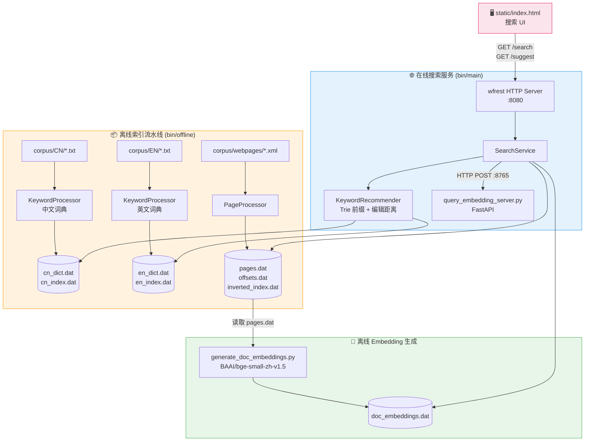
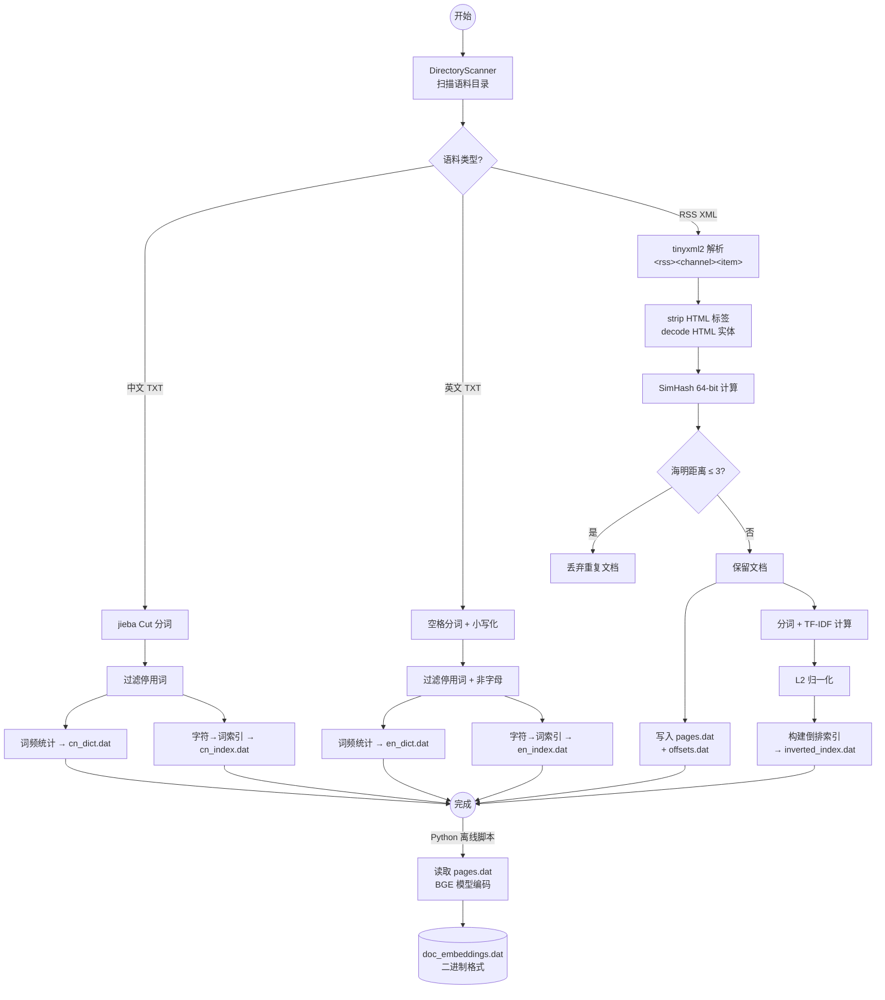

# 🔍 Search Engine — 全文搜索引擎

一个基于 **C++17** 的全文搜索引擎，支持中英文混合检索，采用**稀疏检索（TF-IDF）+ 稠密检索（BERT Embedding）** 的混合召回架构，提供 Web 搜索界面和关键词自动补全/纠错功能。

## 目录

- [特性](#特性)
- [系统架构](#系统架构)
- [离线索引流程](#离线索引流程)
- [在线检索流程](#在线检索流程)
- [混合检索详解](#混合检索详解)
- [目录结构](#目录结构)
- [依赖](#依赖)
- [构建 & 运行](#构建--运行)
- [API 参考](#api-参考)
- [配置参数](#配置参数)
- [核心设计决策](#核心设计决策)

---

## 特性

- 🔡 **中英文双语支持** — 中文采用 jieba 分词，英文采用空格分词，停用词过滤
- 🔀 **混合检索** — TF-IDF 稀疏检索 + BGE 稠密向量检索，线性加权融合
- 💡 **关键词联想** — 基于 Trie 的前缀匹配 + 编辑距离纠错，实时补全
- 🗂️ **离线-在线分离** — 索引构建与搜索服务独立部署，互不干扰
- ⚡ **高性能 C++ 核心** — C++17 + wfrest 异步 HTTP 框架，低延迟响应
- 🎨 **简洁 Web UI** — 仿搜索引擎风格的 SPA 前端，支持高亮、键盘导航
- 🔄 **优雅降级** — Embedding 服务不可用时自动回退到纯 TF-IDF 检索
- 🧹 **近重复检测** — 基于 SimHash + 海明距离的文档去重

---

## 系统架构



## 离线索引流程



### 数据文件格式

| 文件 | 格式 | 说明 |
|------|------|------|
| `pages.dat` | 拼接的 `<doc>` XML 块 | 网页库，按文档 ID 顺序排列 |
| `offsets.dat` | `doc_id\tbyte_offset\tbyte_size` | 每行记录一个文档在 pages.dat 中的偏移 |
| `inverted_index.dat` | `keyword\tdocId\tweight\tdocId\tweight...` | TF-IDF 倒排索引，权重已 L2 归一化 |
| `cn_dict.dat` / `en_dict.dat` | `word\tfrequency` | 关键词词典，用于 autocomplete |
| `cn_index.dat` / `en_index.dat` | `char\tword1\tword2...` | 字符到词的映射，用于编辑距离候选集 |
| `doc_embeddings.dat` | 二进制: `MAGIC(4B) N(4B) dim(4B) [id(4B)+vec(dim×4B)]×N` | 稠密向量索引，MAGIC=0x44454D42 ("DEMB") |

## 在线检索流程

```mermaid
sequenceDiagram
    actor User as 用户
    participant UI as 浏览器 (static/)
    participant SVR as wfrest HTTP Server<br/>:8080
    participant SRV as SearchService
    participant JIEBA as cppjieba 分词器
    participant INV as 倒排索引<br/>(内存)
    participant EMB as Python Embedding<br/>:8765
    participant DR as DenseRetriever
    participant DSK as pages.dat<br/>(磁盘)

    User->>UI: 输入关键词
    UI->>SVR: GET /suggest?q=词
    SVR->>SRV: KeywordRecommender.suggest()
    SRV-->>SVR: JSON 补全/纠错结果
    SVR-->>UI: 下拉提示列表

    User->>UI: 点击搜索 / 回车
    UI->>SVR: GET /search?q=关键词

    SVR->>SRV: search(query)
    SRV->>JIEBA: Cut(query) 分词
    JIEBA-->>SRV: 关键词列表

    SRV->>SRV: 过滤停用词
    SRV->>SRV: computeQueryVector()<br/>TF-IDF + L2 归一化

    par 稀疏检索
        SRV->>INV: 查询词倒排列表
        INV-->>SRV: posting lists
        SRV->>SRV: 交集 (AND 语义)
        SRV->>SRV: Cosine Similarity 排序
    and 稠密检索 (可选)
        SRV->>EMB: POST /embed {"query":"..."}
        EMB-->>SRV: embedding vector [384维]
        SRV->>DR: search(embedding, topK×3)
        DR-->>SRV: 稠密相似度结果
    end

    SRV->>SRV: 分数融合<br/>final = α×TF-IDF + (1-α)×Dense
    SRV->>SRV: 排序 + Top-K 截断

    loop 每个结果文档
        SRV->>DSK: seekg(offset) + read(size) 🔒 mutex
        DSK-->>SRV: XML &lt;doc&gt; 块
        SRV->>SRV: 解析 title/link/content
        SRV->>SRV: generateAbstract() 截断 300 字节
    end

    SRV-->>SVR: JSON 搜索结果
    SVR-->>UI: [{id, title, link, abstract}, ...]
    UI->>UI: 渲染结果 + 关键词高亮
```

## 混合检索详解

```mermaid
flowchart LR
    Q[用户查询] --> TOK[分词 + 去停用词]
    TOK --> QVEC[TF-IDF 查询向量<br/>L2 归一化]

    QVEC --> SPARSE[稀疏检索支路]
    QVEC --> DENSE[稠密检索支路]

    subgraph SPARSE[稀疏检索]
        S1[取倒排列表交集<br/>AND 语义] --> S2[Cosine Similarity<br/>计算每个候选文档]
        S2 --> S3[sparseScores<br/>范围: 0~1]
    end

    subgraph DENSE[稠密检索]
        D1[POST /embed<br/>BGE 模型编码] --> D2[查询向量 384维<br/>归一化]
        D2 --> D3[Dot Product<br/>与所有文档向量]
        D3 --> D4[denseScores<br/>范围: -1~1]
        D4 --> D5[归一化: (score+1)/2<br/>范围: 0~1]
    end

    S3 --> FUSE[线性加权融合<br/>final = 0.5×sparse + 0.5×dense]
    D5 --> FUSE

    FUSE --> SORT[降序排序 → Top-K]
    SORT --> LOAD[加载完整文档]
    LOAD --> RESULT[JSON 结果]

    style SPARSE fill:#fff8e1,stroke:#ff8f00
    style DENSE fill:#e8eaf6,stroke:#3f51b5
    style FUSE fill:#fce4ec,stroke:#e91e63
```

**融合策略：**
- 稠密分数从 [-1, 1] 映射到 [0, 1]，与 TF-IDF cosine 对齐
- 候选集 = 稀疏交集文档 ∪ 稠密 Top-3K 文档
- 融合权重 α = 0.5（可配置），稀疏和稠密各占一半
- 稠密服务不可用时自动回退到纯 TF-IDF

### 关键词推荐流程

```mermaid
flowchart TD
    Q[输入前缀] --> TRIE[Trie 前缀遍历]
    TRIE --> COLLECT[DFS 收集子树下<br/>所有完整词]
    COLLECT --> SORT[按词频降序]

    SORT --> SUFF{结果 ≥ 5?}
    SUFF -->|是| JSON1[标注 type: prefix]
    SUFF -->|否| ED[编辑距离扫描<br/>全词典]

    ED --> FILTER[按长度差剪枝<br/>maxDist = f(len)]
    FILTER --> TOP[取最小编辑距离词<br/>按词频排序]
    TOP --> JSON2[标注 type: correction]

    JSON1 --> OUTPUT[JSON 结果]
    JSON2 --> OUTPUT
```

**编辑距离阈值策略：**
| 查询长度 | 最大编辑距离 | 原因 |
|---------|------------|------|
| ≤ 2 字符 | 1 | 短词容易过度纠错 |
| ≤ 5 字符 | 2 | 中等长度允许更多差异 |
| > 5 字符 | 3 | 长词容忍更大编辑距离 |

---

## 目录结构

```
Search_Engine_cpp/
├── README.md                       # 本文件
├── Makefile                        # 构建系统
├── .gitignore
│
├── bin/                            # 编译产物 (gitignored)
│   ├── main                        # 在线搜索服务
│   └── offline                     # 离线索引工具
│
├── build/                          # 中间目标文件 (gitignored)
│
├── include/                        # 头文件 (7 个)
│   ├── DirectoryScanner.h          # 目录扫描器
│   ├── KeywordProcessor.h          # 关键词词典构建器
│   ├── KeywordRecommender.h        # Trie + 编辑距离推荐
│   ├── PageProcessor.h             # 网页索引构建器
│   ├── SearchServer.h              # HTTP 服务入口
│   ├── SearchService.h             # 搜索核心逻辑
│   └── DenseRetriever.h            # 稠密向量检索器
│
├── src/                            # 源文件 (8 个)
│   ├── offline.cc                  # 离线流水线入口
│   ├── DirectoryScanner.cc         # POSIX 目录遍历
│   ├── KeywordProcessor.cc         # 中英文词典构建
│   ├── KeywordRecommender.cc       # Trie 实现 + 编辑距离
│   ├── PageProcessor.cc            # XML 解析 + SimHash + TF-IDF
│   ├── SearchServer.cc             # main() + HTTP 路由
│   ├── SearchService.cc            # 搜索 + 融合 + libcurl
│   └── DenseRetriever.cc           # 二进制向量加载 + dot product
│
├── embedding/                      # Python Embedding 服务
│   ├── requirements.txt            # sentence-transformers, fastapi...
│   ├── query_embedding_server.py   # 在线 query embedding API
│   └── generate_doc_embeddings.py  # 离线批量生成文档向量
│
├── static/                         # Web 前端
│   ├── index.html                  # SPA 主页面
│   ├── style.css                   # 仿 Google 风格样式
│   └── script.js                   # 搜索逻辑 + 联想补全
│
├── corpus/                         # 原始语料
│   ├── CN/*.txt                    # 中文文本
│   ├── EN/*.txt                    # 英文文本
│   └── webpages/*.xml              # RSS XML 网页
│
├── stopwords/                      # 停用词表
│   ├── cn_stopwords.txt            # 505 个中文停用词
│   └── en_stopwords.txt            # 816 个英文停用词
│
└── data/                           # 索引文件 (gitignored)
    ├── pages.dat                   # 网页库
    ├── offsets.dat                 # 网页偏移库
    ├── inverted_index.dat          # 倒排索引
    ├── cn_dict.dat                 # 中文词典
    ├── en_dict.dat                 # 英文词典
    ├── cn_index.dat                # 中文字符索引
    ├── en_index.dat                # 英文字符索引
    └── doc_embeddings.dat          # 稠密向量 (可选)
```

## 依赖

### C++ 库

| 库 | 用途 | 类型 |
|---|------|------|
| **cppjieba** | 中文分词 (MixSegment) | Header-only |
| **simhash** | 文档 SimHash + 去重 | Header-only |
| **tinyxml2** | RSS XML 解析 | 动态链接 (`-ltinyxml2`) |
| **workflow** | 异步网络框架 (wfrest 依赖) | 动态链接 (`-lworkflow`) |
| **wfrest** | HTTP 服务框架 (路由、CORS、静态文件) | 动态链接 (`-lwfrest`) |
| **libcurl** | HTTP 客户端 (调用 Python embedding 服务) | 动态链接 (`-lcurl`) |
| **nlohmann/json** | JSON 序列化/反序列化 | Header-only |
| **utfcpp** | UTF-8 字符级迭代 | Header-only |

### Python 包

| 包 | 用途 |
|---|------|
| `sentence-transformers>=2.2.0` | BGE 模型加载与推理 |
| `fastapi>=0.100.0` | Query Embedding REST API |
| `uvicorn>=0.23.0` | ASGI 服务器 |
| `torch>=2.0.0` | PyTorch 后端 |
| `numpy` | 向量处理 |

### 系统要求

- **编译器**: g++ (支持 C++17)
- **OS**: Linux (使用 POSIX API)
- **Python**: 3.8+ (用于 Embedding 服务)

---

## 构建 & 运行

### 1. 编译 C++ 项目

```bash
# 安装系统依赖 (Ubuntu/Debian)
sudo apt-get install -y g++ libtinyxml2-dev libcurl4-openssl-dev

# cppjieba, simhash, utfcpp, nlohmann 需放到 /usr/local/include 下
# wfrest 需从源码编译安装

# 编译
make clean && make
```

编译产物：
- `bin/offline` — 离线索引工具
- `bin/main` — 在线搜索服务

### 2. 准备语料

将语料放入对应目录：
- `corpus/CN/` — 中文 `.txt` 文件
- `corpus/EN/` — 英文 `.txt` 文件
- `corpus/webpages/` — RSS `.xml` 文件

### 3. 执行离线索引

```bash
# 运行离线流水线（生成 data/*.dat）
./bin/offline
```

### 4. 生成文档稠密向量（可选）

```bash
pip install -r embedding/requirements.txt
python embedding/generate_doc_embeddings.py
```

### 5. 启动服务

**终端 1 — 启动 Embedding 微服务（可选，但推荐）：**

```bash
python embedding/query_embedding_server.py
# 监听 0.0.0.0:8765
```

**终端 2 — 启动搜索服务：**

```bash
./bin/main
# 监听 0.0.0.0:8080
```

### 6. 使用

打开浏览器访问 `http://localhost:8080`，开始搜索。

- 输入关键词自动弹出联想/纠错
- `↑` `↓` 键选择建议项
- `Enter` 执行搜索
- `/` 键聚焦搜索框

---

## API 参考

### 搜索接口

```
GET /search?q=<query>
```

**响应：**

```json
[
  {
    "id": 42,
    "title": "文章标题",
    "link": "https://example.com/article",
    "abstract": "内容摘要...（最多 300 字节）"
  }
]
```

### 关键词推荐

```
GET /suggest?q=<prefix>
```

**响应：**

```json
[
  {"word": "人工智能", "freq": 1234, "type": "prefix"},
  {"word": "人工", "freq": 567, "type": "correction"}
]
```

- `type: "prefix"` — Trie 前缀匹配结果
- `type: "correction"` — 编辑距离纠错结果

### 健康检查

```
GET /health
```

**响应：**

```json
{"status": "ok", "docs": 1234}
```

### Embedding 服务

```
POST /embed
Content-Type: application/json

{"query": "人工智能"}

→ {"embedding": [0.123, -0.456, ...], "dim": 384}
```

---

## 配置参数

所有参数目前硬编码在源码中，无运行时配置文件：

| 参数 | 默认值 | 位置 | 说明 |
|------|--------|------|------|
| 搜索端口 | 8080 | [SearchServer.cc](src/SearchServer.cc) | HTTP 监听端口 |
| Embedding 服务地址 | `http://localhost:8765/embed` | [SearchService.h](include/SearchService.h#L70) | Python 微服务 URL |
| 融合权重 α | 0.5 | [SearchService.h](include/SearchService.h#L69) | TF-IDF 与 Dense 的融合比例 |
| 搜索结果数量 | 20 | [SearchService.cc](src/SearchService.cc#L107) | 每次搜索返回 Top-K |
| 摘要最大长度 | 300 字节 | [SearchService.cc](src/SearchService.cc#L255) | 按 UTF-8 边界截断 |
| 推荐数量 | 5 | [KeywordRecommender.h](include/KeywordRecommender.h#L17) | suggest 接口返回数 |
| Dense 检索候选倍数 | 3× | [SearchService.cc](src/SearchService.cc#L198) | 稠密检索候选数 = topK × 3 |
| Embedding 超时 | 3000ms | [SearchService.cc](src/SearchService.cc#L355) | libcurl 超时 |
| Embedding 维度 | 384 | BGE 模型决定 | `BAAI/bge-small-zh-v1.5` |
| SimHash TopN | max(5, min(200, len/120)) | [PageProcessor.cc](src/PageProcessor.cc#L186) | 动态计算 |
| SimHash 去重阈值 | 海明距离 ≤ 3 | [PageProcessor.cc](src/PageProcessor.cc#L198) | 视为重复 |
| Embedding 文件 Magic | `0x44454D42` | [DenseRetriever.cc](src/DenseRetriever.cc#L10) | "DEMB" ASCII |

---

## 核心设计决策

### 1. 离线-在线分离

索引构建 (`bin/offline`) 和在线服务 (`bin/main`) 是两个独立可执行文件。好处：
- 索引构建可离线运行，不阻塞在线服务
- 索引数据和二进制可独立更新
- 减少在线进程的内存占用（无需加载分词词库的完整状态）

### 2. 自制文件存储，零数据库依赖

所有索引数据使用自定义文本/二进制格式存储，不使用 SQLite、MySQL 等数据库。原因：
- 搜索引擎的查询模式固定（按关键词查倒排、按 ID 查文档），无需关系型查询
- 自定义格式零开销，加载速度快
- 减少部署依赖

### 3. AND 语义交集 + 稠密兜底

稀疏检索采用严格的 AND 语义（所有查询词都命中才算候选），提高精度。但同时引入稠密检索作为补充，覆盖以下场景：
- 查询词不在倒排索引中（如口语化表达）
- 语义相关但字面不匹配的文档
- AND 交集为空时提供兜底结果

### 4. SimHash O(n²) 去重

采用 SimHash 64-bit 指纹 + 海明距离进行近重复检测。虽然 O(n²) 复杂度，但在语料规模适中（几千到几万篇）时完全可接受，且离线流程对性能不敏感。

### 5. 线程安全的流式文档读取

`pagesStream_` 由多个 HTTP 请求线程并发访问（每个请求需要加载 Top-K 文档的内容），通过 `std::mutex` 保护 `seekg` + `read` 的原子性。不将全部文档加载到内存以控制内存占用。

### 6. 优雅降级

Dense 检索模块的每个环节都有容错：
- `doc_embeddings.dat` 不存在 → 跳过稠密检索
- Python Embedding 服务不可达 / 超时 → 回退到纯 TF-IDF
- JSON 解析失败 → 返回空向量
- 任何错误不影响主搜索流程

### 7. 单文件 SPA 前端

前端为纯静态 HTML + CSS + JS，不依赖任何框架或构建工具：
- 关键字提取在客户端完成（正则匹配中英文 Token）
- 搜索结果关键词高亮
- 300ms 防抖的 suggest 请求
- 键盘快捷键（`↑↓` 导航 / `Enter` 搜索 / `Esc` 关闭 / `/` 聚焦）

---

## 路线图 / TODO

- [ ] 引入 BM25 替代 TF-IDF
- [ ] 分页支持（大结果集懒加载）
- [ ] 搜索结果缓存（LRU）
- [ ] 配置文件支持（TOML/YAML）
- [ ] Docker 一键部署
- [ ] 增量索引更新
- [ ] 搜索日志与点击率统计
- [ ] 更多 Embedding 模型可选（如 multilingual-e5）

---

## License

MIT
